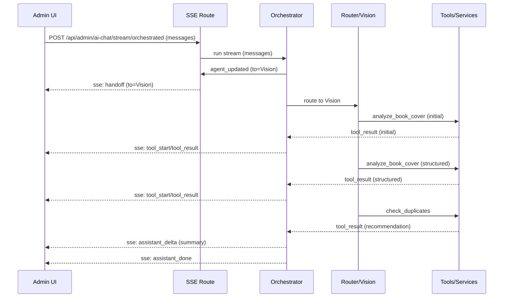

# Admin AI — Overview (Code Owner Doc)

This is the single entry point for the Admin AI chat: what it is, how it works, how to run it, and how to troubleshoot it. It links directly to the code that lives under this folder.

## Quick Start
- Requirements
  - Node 20.18+
  - Env: `OPENAI_API_KEY`, `NEXT_PUBLIC_SUPABASE_URL`, `NEXT_PUBLIC_SUPABASE_ANON_KEY`, `SUPER_ADMIN_EMAIL`, `CLOUDINARY_URL`
- Run
  - `npm run dev`
  - Visit `/{locale}/admin/ai-chat` (example: `/en/admin/ai-chat`). You must be signed in as an admin.
- Use
  - Drag a cover photo into the input, then ask e.g. “Analyze this book and prepare to add it.”
  - The system streams: `handoff` → assistant text → tool events (analyze → structured → duplicate check) → `assistant_done`.
- Helpful toggles
  - Client SSE logs: disable with `NEXT_PUBLIC_ADMIN_AI_TRACE_DISABLED=1` (default: ON)
  - Server logs: disable with `ADMIN_AI_TRACE_DISABLED=1` (default: ON)
  - Deep diagnostics: `DEBUG_LOGS=1` (prints compact shapes for unexpected stream events)

## Architecture (at a glance)

```mermaid
flowchart TD
  subgraph UI[Admin UI]
    A[ChatInput/MessageList<br/>src/components/admin/ai-chat/*]
    AC[Chat Hook<br/>useChatSession.ts]
    AC -->|SSE| T
  end

  subgraph API[Next.js API]
    T[POST /api/admin/ai-chat/stream/orchestrated<br/>route.ts]
    O[Orchestrator (Agents SDK)<br/>orchestrator-agentkit.ts]
  end

  subgraph Agents
    R[Router]
    V[Vision]
    I[Inventory]
    D[Orders]
  end

  subgraph Tools
    VT[Vision Tools<br/>analyze_book_cover, analyze_item_photo, check_duplicates]
    IT[Inventory Tools<br/>create/update/search/adjust]
    OT[Order Tools<br/>get/search/update]
  end

  subgraph Services
    VS[Vision Services<br/>cover/item/similarity]
    DBH[DB Helpers]
  end

  subgraph External
    OAI[OpenAI (text/vision)]
    SUPA[Supabase]
    CLD[Cloudinary]
  end

  A --> AC
  T --> O
  O --> R
  R -->|handoff| V
  R -->|handoff| I
  R -->|handoff| D

  V --> VT
  I --> IT
  D --> OT

  VT --> VS
  VS --> CLD
  VS --> OAI

  IT --> DBH
  OT --> DBH
  DBH --> SUPA
```

## Typical Event Sequence (SSE)



## SSE Event Cheat‑Sheet
UI consumes versioned events from `src/lib/admin/types/events.ts`. Examples below are abbreviated for clarity.

```json
{ "type": "handoff", "to": "Vision", "request_id": "b1730a55..." }
{ "type": "assistant_delta", "content": "Analyzing cover..." }
{ "type": "tool_start", "id": "call_1", "name": "analyze_book_cover", "args": { "stage": "initial", "image_url": "https://..." }, "startedAt": "2025-10-28T...Z" }
{ "type": "tool_result", "id": "call_1", "name": "analyze_book_cover", "success": true, "result": { "vision_analysis": { "natural_analysis": { "summary": "..." } } }, "finishedAt": "2025-10-28T...Z" }
{ "type": "tool_append", "message": { "role": "tool", "name": "analyze_book_cover", "tool_call_id": "call_1", "content": "{\\"success\\":true,\\"message\\":\\"...\\",\\"data\\":{...}}" } }
{ "type": "assistant_done" }
```

## Code Map
- API entry (SSE)
  - `src/app/api/admin/ai-chat/stream/orchestrated/route.ts` — Admin‑only; adds `request_id`, rate limit + concurrency.
  - `src/app/api/admin/ai-chat/stream/text/route.ts` — Content‑only streaming (assistant_delta + assistant_done), no tool execution.
- Orchestrator
  - `src/lib/admin/chat/orchestrator-agentkit.ts` — Connects Agents SDK and streams normalized events.
- Agents & Tools
  - Registry: `src/lib/admin/agents/index.ts`
  - Router: `src/lib/admin/agents/router.ts`
  - Vision: `src/lib/admin/agents/vision.ts`
  - Inventory: `src/lib/admin/agents/inventory.ts`
  - Orders: `src/lib/admin/agents/orders.ts`
  - Tool definitions: `src/lib/admin/agents/tools.ts`
- Vision Services
  - Cover analysis: `src/lib/admin/services/vision/cover-analysis.ts`
  - Item analysis: `src/lib/admin/services/vision/item-analysis.ts`
  - Similarity: `src/lib/admin/services/vision/similarity.ts`; schemas at `src/lib/admin/services/vision/schemas.ts`
- Event Contract & Client
  - Types: `src/lib/admin/types/events.ts`
  - Normalizer: `src/lib/admin/chat/normalize-agent-events.ts`
  - SSE client: `src/lib/admin/chat/client/sse-transport.ts` (+ README there)
  - UI hook & components: `src/components/admin/ai-chat/hooks/useChatSession.ts`, `src/components/admin/ai-chat/*`

## Models & Configuration
- OpenAI models
  - Default text: `gpt-5-mini`; override via `OPENAI_TEXT_MODEL`.
  - Default vision: `gpt-5-mini`; override via `OPENAI_VISION_MODEL`.
  - Source: `src/lib/openai/models.ts`, `src/lib/openai.ts`.
- Limits & security
  - Route limits + per‑user concurrency: `src/lib/security/limits.ts`, `src/lib/security/ratelimit.ts`
  - Admin gate: `src/lib/security/guards.ts` via `src/middleware.ts`
- Cloudinary uploads
  - Client hook: `src/components/admin/ai-chat/hooks/useImageUpload.ts`
  - Server helpers: `src/lib/admin/image-upload.ts`, config in `src/lib/admin/constants.ts`
  - Signed upload endpoint: `src/app/api/upload/sign/route.ts`

## Troubleshooting
- “Handoff to Vision” then silence
  - Normalizer now handles nested message/delta shapes; if it ever occurs, set `DEBUG_LOGS=1` to log compact shapes.
  - Code: `src/lib/admin/chat/normalize-agent-events.ts`, `src/lib/admin/chat/orchestrator-agentkit.ts`
- 401 Unauthorized
  - Ensure admin login and role; `SUPER_ADMIN_EMAIL` must be set or your DB role set to admin.
  - Where enforced: `src/lib/security/guards.ts:27` (`assertAdmin`), `src/middleware.ts:109` (admin gate using `is_admin` RPC).
- 429 Rate limited / concurrency
  - See `src/lib/security/limits.ts`; for local dev without Vercel KV, use `KV_USE_MEMORY=1`.
- Tool schema “uri” format error
  - Use `src/lib/schema/http-url.ts` for Agents tool URL params; avoid `.url()` which emits `format: 'uri'`.
- OpenAI config error
  - Ensure `OPENAI_API_KEY` for admin calls; `OPENAI_API_KEY_USER` for user-key flows if used.

### Known Pitfalls
- Vision JSON must be valid JSON text; helpers expect model output to be strictly JSON and will throw on non‑JSON (see `src/lib/admin/services/vision/helpers.ts`).
- Rate limiting/concurrency depends on a KV backend; without a configured KV, set `KV_USE_MEMORY=1` locally (dev only).
- Tool results are unwrapped to `data` for `tool_result`, but the full envelope is sent via `tool_append` for transcript continuity.
- Agents SDK updates can change event shapes; our normalizer is resilient, but if upgrading `@openai/agents*`, run tests and enable `DEBUG_LOGS=1` to see shapes.

## Validation
- Manual E2E plan: `doc/admin-ai/e2e-manual-test.md`
- Unit tests: `test/admin-ai/*`

## Related Docs
- Features: `doc/admin-ai/features.md`
- UI roadmap: `doc/admin-ai/admin-ai-ui-roadmap.md`
- Client helpers README: `src/lib/admin/chat/client/README.md`

## cURL Smoke Test (needs admin session cookie)

```bash
curl -N \
  -H 'Content-Type: application/json' \
  -H 'Cookie: <your-supabase-session-cookies>' \
  -X POST http://localhost:3000/api/admin/ai-chat/stream/orchestrated \
  -d '{
    "messages": [
      {
        "role": "user",
        "content": [
          { "type": "text", "text": "请分析这本书封面并准备创建条目。" },
          { "type": "image_url", "image_url": { "url": "https://res.cloudinary.com/demo/image/upload/sample.jpg" } }
        ]
      }
    ],
    "uiLanguage": "zh"
  }'
```

## Version Compatibility
- Agents SDK / OpenAI provider pinned to `^0.1.9`. Our normalizer handles nested `output_text(.delta)` shapes. If upgrading these deps, re‑run `npm test` and consider enabling `DEBUG_LOGS=1` during initial validation to inspect event shapes.
